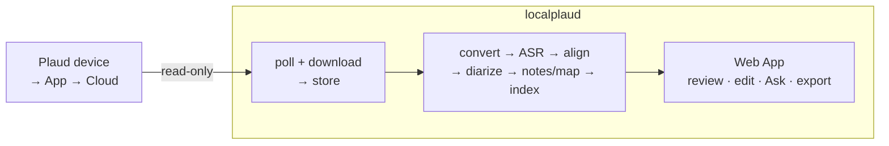

<p align="center">
  
</p>

<h1 align="center"></h1>

<p align="center">
  <b>A self-hosted replacement for the Plaud Intelligence workflow.</b> Keep using
  your physical Plaud recorder and its raw-audio upload path; localplaud takes over
  transcription, speakers, notes, search, Ask, and export on machines you control.
</p>

<p align="center">
  <a href="#how-it-works">How it works</a> ·
  <a href="#quickstart">Quickstart</a> ·
  <a href="#configuration">Configuration</a> ·
  <a href="#asr-providers">ASR providers</a> ·
  <a href="#deploying-to-your-own-machines">Deploy</a>
</p>

---

## Why

Plaud's hardware and device sync are useful; its paid Intelligence workflow should
be optional. **localplaud** treats the official Plaud cloud as a transport and source
of truth for *raw audio* only, then independently rebuilds the useful workflow —
download, transcode, transcribe, align, diarize, correct, summarize, map, search,
Ask, and export — on hardware you control. It replaces the subscription processing
experience, not the recorder or the App's device-upload role.

The browser runtime is self-contained: HTMX is vendored with its upstream license
and pinned checksum, so normal Web App interaction does not depend on a CDN.

> Record and upload as usual, but do not need to press Plaud's Generate button.
> localplaud polls the read-only Open API, downloads the audio, and owns every
> derived artifact. See the [target product workflow](docs/product-workflow.md).

## Status

The core skeleton works: OAuth polling through **Plaud's official Open API**,
a safe metadata-only first catalog sync followed by automatic download of new raw
audio, pluggable local ASR, diarization, LLM notes, embeddings/Q&A, audio
playback, and a FastAPI Web App. It runs natively and in Docker profiles.

The subscription-replacement experience is **in progress**, not complete. The
default `independent` artifact mode refuses Plaud transcripts as pipeline input,
preserves them as visibly labelled imports, and safely requeues legacy cloud-derived
rows for local ASR. Durable stage records preserve attempts, provider/model
provenance, timing, and actionable failures; optional-stage failures retain usable
transcripts and notes for targeted resume. Full-transcript hierarchical notes,
resumable mind maps, OpenCode Go contextual transcript polishing, transcript
revisions, editable per-recording speaker names,
single-file Ask with playable citations, richer library filters, and Plaud-style
Add audio / Import from Plaud flows are implemented. A Plaud import refreshes the
entire metadata catalog plus any existing Plaud transcript/summary while leaving raw
audio remote until the user requests one recording. After that baseline, scheduled
polling automatically downloads recordings first observed as new uploads. The
recording export dialog
produces transcript TXT/SRT/VTT/DOCX/PDF formats with timestamp/speaker controls.
PDF embeds a portable Traditional Chinese font. Generated and Saved notes export as
Markdown, TXT, DOCX, or PDF; original-audio, mind-map image, and Markdown archive
exports remain available. Transcript and current notes can be copied directly, and
the Library can export up to 50 selected recordings as one provenance-aware ZIP with
a partial-availability manifest. Library and recording Ask surfaces also provide a
searchable, paginated conversation-history drawer with rename/delete controls;
deleting a conversation preserves any Saved notes created from its answers. Durable
provider/model/execution profiles, explicit
stage fallbacks, remote workers, local AutoFlow rules, inbox notifications,
TXT/SRT/VTT AutoFlow exports, scoped authorized webhooks, and authorized SMTP email
delivery are also implemented.
The remaining work centers on broader integrations and Plaud-level Web App polish.
Plaud-produced
transcripts and summaries may be imported for
migration or comparison, but are not part of the target primary workflow.

## How it works



- **poller** — polls the Plaud cloud API, detects new or updated files (via
  `version`/`version_ms`), downloads the `.opus` audio.
- **store** — audio bytes on the filesystem; metadata, transcripts, summaries
  and embeddings in SQLite.
- **worker** — the independent pipeline: audio → Whisper large-v3-turbo → durable
  word alignment (selectable WhisperX/wav2vec2 forced alignment) → speaker diarization
  → notes/mind map → embeddings.
- **api / ui** — the primary daily-use Web App: browse, listen, review, edit,
  regenerate, organize, Ask, and export.

## Quickstart

Requirements: **Python 3.11+**, **ffmpeg**, and (for local ASR) a Whisper
backend. [uv](https://github.com/astral-sh/uv) is recommended.

```bash
git clone https://github.com/skyhong2002/localplaud
cd localplaud

# install (choose extras for the ASR you want — see below)
uv sync --extra faster-whisper          # local ASR, CPU/CUDA
# Add --extra forced-align for selectable WhisperX/wav2vec2 word alignment.
#   or: pip install -e ".[faster-whisper]"
# Apple Silicon: uv sync --extra mlx
#   or: pip install -e ".[mlx]"

cp config.example.toml config.toml      # edit to taste
cp .env.example .env                    # put secrets here (git-ignored)

localplaud init                         # create the database
localplaud auth login                   # one-time browser OAuth (official API)
localplaud auth check                   # verify your Plaud session works
localplaud poll --once                  # pull the file list + download audio
localplaud work --once                  # run the pipeline on downloaded files
localplaud serve                        # web UI at http://localhost:8080
```

The MLX extra constrains NumPy to the range currently supported by numba, which
mlx-whisper uses for word timestamps. `localplaud doctor` reports the underlying
import error if that local speech stack becomes incompatible.

Or run everything as a daemon (poll on a schedule + process continuously):

```bash
localplaud run
```

Automatic processing is a durable workspace preference under **Settings → Workspace**.
When it is paused, the daemon continues polling and downloading new raw audio, while
recordings wait for an explicit Resume/Reprocess action before any AI provider is used.

### Commands

| Command | What it does |
| --- | --- |
| `localplaud init` | Create the database + data dirs |
| `localplaud auth login` / `auth check` | One-time OAuth sign-in / verify the session |
| `localplaud doctor` | Check ffmpeg + your ASR/LLM/embedding providers + auth |
| `localplaud prepare-independent [--force]` | Preserve imports and requeue legacy cloud-derived files for local ASR |
| `localplaud poll [--once]` | Sync the cloud listing + download audio |
| `localplaud work [--once] [--force]` | Run the pipeline on downloaded recordings |
| `localplaud run` | Poll + process + serve, all together |
| `localplaud ls` / `status` | List recordings / counts by stage |
| `localplaud ask "…"` | Q&A across all transcripts |
| `localplaud reprocess <id>` | Re-run the pipeline on one recording |
| `localplaud export <id> [-o …]` | Export a recording to Markdown |
| `localplaud serve` | Web UI only |

### Connect Plaud

localplaud never sees your Plaud password. The default provider is **Plaud's
official Open API**: run `localplaud auth login` once — it opens your browser
for native S256 PKCE OAuth (no Node.js required) and caches an
auto-refreshing token set in `~/.plaud/tokens.json`. The official Plaud MCP is
also supported with `plaud.provider = "mcp"`; install and authorize it with
`npx -y @plaud-ai/mcp@latest install`.

`localplaud auth check` confirms whichever provider is configured. See
[`docs/plaud-api.md`](docs/plaud-api.md) for API details.

## Configuration

All configuration lives in `config.toml` (copy from
[`config.example.toml`](config.example.toml)). Every value can be overridden by
an environment variable prefixed `LOCALPLAUD_` with `__` between levels, so
**secrets stay out of the file** and in `.env`:

```bash
LOCALPLAUD_ASR__OPENAI__API_KEY="sk-..."
LOCALPLAUD_DIARIZE__HF_TOKEN="hf_..."
```

`pipeline.artifact_mode = "independent"` is the default and accepts only locally
generated transcripts as pipeline completion. Explicit `migration` mode can import
Plaud Intelligence artifacts for comparison/backfill; imported rows keep their
provenance and never silently replace a later local transcript.

For Ollama-backed LLMs or embeddings, `localplaud doctor` validates the configured
model as well as the daemon. A missing model is reported with the exact `ollama pull`
command; embedding uses Ollama's batch `/api/embed` endpoint when available.

Transcript correction is an explicit stage-scoped LLM selection. The initial profile
uses the configured `[llm]` provider, while later profile versions may select any
catalog model that advertises the `correct` capability, including Ollama, OpenAI,
Anthropic, OpenCode Go, or the experimental Codex CLI adapter. The resolved connection,
model, non-secret configuration,
privacy boundary, and secret reference are persisted before dispatch; unavailable
providers fail visibly unless the profile declares an allowed fallback. For OpenCode
Go, the tracked `transcript-polish` agent denies every tool and OpenCode continues to
own its credential. Correction batching is provider-aware: conservative runtimes use
bounded requests, while large-context Codex starts with a larger batch and bisects only
when the returned segment structure is incomplete. Transport and quota failures are
never converted into additional split calls.

The `codex-local` adapter is an explicit trusted-single-user option for transcript
correction. It invokes `codex exec` through stdin in an ephemeral, read-only,
temporary workspace with strict, fail-closed flags that disable the supported shell,
browser, computer-use, app, plugin, multi-agent, and workspace tools. localplaud never
reads or copies Codex credentials. Its
dedicated `CODEX_HOME` must be signed in normally with ChatGPT before the provider is
healthy; API-key login is rejected by default so the UI cannot misrepresent API
billing as included Codex subscription usage. It is cloud inference and must not be
used as an unattended public or multi-user default.

Set up that isolated login interactively on the trusted local host:

```bash
mkdir -p ~/.localplaud/codex
CODEX_HOME=~/.localplaud/codex codex login
CODEX_HOME=~/.localplaud/codex codex login status
.venv/bin/localplaud doctor
```

The health check confirms that the dedicated home uses ChatGPT or an approved access
token; it does not spend usage to probe the model and therefore does not claim that
the selected model or remaining allowance is currently available. Create a new
immutable execution-profile version and select `correct:codex-local` only for the
`correct` stage. `codex-local` is intentionally rejected as the global `[llm]`
provider, so summaries, mind maps, and Ask cannot be moved across this experimental
boundary accidentally.

## ASR providers

ASR remains pluggable, but the subscription-independent quality baseline is local
**Whisper large-v3-turbo**. On Apple Silicon the target model is
`mlx-community/whisper-large-v3-turbo`; on CUDA/CPU use the equivalent
faster-whisper/CTranslate2 model. Cloud ASR remains an explicit operator choice,
not a silent fallback.

Whisper does not identify speakers. Plaud-like speaker results require a complete
pipeline of VAD, turbo ASR, word-level alignment, diarization (pyannote or a
benchmarked equivalent), and speaker assignment. A provider returning only text is
therefore not considered the complete default experience.

The open-source diarization default is
`pyannote/speaker-diarization-community-1`. Before first use, accept that gated
model's Hugging Face terms and set `LOCALPLAUD_DIARIZE__HF_TOKEN`;
`localplaud doctor` reports missing package/token state explicitly.

| Provider          | Type   | Runs on                    | Diarization |
| ----------------- | ------ | -------------------------- | ----------- |
| `faster-whisper`  | local  | CPU / NVIDIA CUDA          | via pyannote |
| `whispercpp`      | local  | Apple Silicon (Metal) / CPU | via pyannote |
| `mlx-whisper`     | local  | Apple Silicon (MLX)        | via pyannote |
| `openai`          | cloud  | any                        | via pyannote |
| `deepgram`        | cloud  | any                        | built-in    |
| `assemblyai`      | cloud  | any                        | built-in    |

See [ADR 0003](docs/adr/0003-pluggable-asr.md) for the target quality contract.

## Deploying to your own machines

localplaud ships a single Docker Compose file with **profiles** so one repo runs
on very different hardware:

| Profile | Target machine        | ASR                                   |
| ------- | --------------------- | ------------------------------------- |
| `mac`   | Apple Silicon Mac     | local Whisper (Metal, outside Docker) |
| `gpu`   | NVIDIA (CUDA)         | local Whisper in-container (CUDA)      |
| `cpu`   | small/cloud CPU boxes | cloud ASR API                         |

A bundled Caddy reverse proxy terminates HTTPS for your domain automatically.
See [`docs/deploy.md`](docs/deploy.md).

## Development

```bash
uv sync --extra dev
ruff check . && pytest
```

Audit a processed recording against the subscription-independent raw-audio product
gate with `localplaud acceptance-check RECORDING_ID`; use `--json` in automation.
The recording workspace shows the same expandable evidence without CLI access. See
[`docs/acceptance.md`](docs/acceptance.md).

## Security

- Secrets (Plaud session, API keys, HF token) go in `.env` or environment
variables — **never** in a committed file. `config.toml`, `.env`, `*.cookie`
  and `*.token` are git-ignored.
- localplaud only ever issues **read-only** requests against the Plaud cloud,
  and refuses to fetch non-`https` or private-IP URLs (SSRF-guarded), with
  bounded downloads.
- The web UI binds to `127.0.0.1` by default. **Before exposing it**, configure
  `LOCALPLAUD_API__LOGIN_PASSWORD` and `LOCALPLAUD_API__SESSION_SECRET` to enable
  the built-in `/login` page over HTTPS. `api.auth_token` remains available for
  non-browser API clients. See [ADR 0006](docs/adr/0006-security-posture.md).
- Settings can create private, checksummed workspace backups from a consistent
  SQLite snapshot, optionally including local media, then upload them to an
  explicitly authorized HTTPS or private/LAN destination with durable, idempotent
  retries. Secrets, configuration, and Plaud OAuth tokens are excluded; configure,
  verify, and restore using
  [`docs/backups.md`](docs/backups.md).
- Settings reports the built-in Web login and API-token boundary, lists revocable
  browser sessions, and can download aggregate, redacted diagnostics for support. See
  [`docs/support.md`](docs/support.md).
- Workspace preferences can persist English or Traditional Chinese (Taiwan) for the
  shared shell and primary library, search, notes, automation, template, and status
  pages and the recording workspace, with matching document language and local date
  formatting. Settings navigation and primary configuration/integration controls are
  also translated; dynamic helper, health, and error/action coverage is still expanding.

## License

[MIT](LICENSE) © 2026 Sky Hong

> localplaud is an independent, unofficial project and is not affiliated with,
> endorsed by, or connected to Plaud. It only accesses your own account's data.
